# 🔐 SecurePass Generator

A cryptographically secure password generator built with React and TypeScript. Generate strong, customizable passwords with real-time strength analysis and secure hashing - all processed locally in your browser with zero data storage or transmission.

  

> 💡 **Quick Start:** Jump to the [Demo](#-demo) section to see the password generator in action!

## 📸 Demo

### 🎬 Password Generation in Action



> **Interactive Features Shown:**
> - 🔄 Real-time password generation with instant strength feedback
> - 🎚️ Dynamic length adjustment from 8-128 characters
> - 🔤 Toggle character types (uppercase, lowercase, numbers, symbols)
> - 🎯 Quick preset selection (Basic, Standard, Maximum, PIN, Passphrase)
> - 📋 One-click copy to clipboard
> - 🔐 Automatic secure hash generation (SHA-256, SHA-512, PBKDF2)
> - ⚡ Smooth animations and instant visual feedback

**Want to add a real demo GIF?** See [DEMO_RECORDING_GUIDE.md](./DEMO_RECORDING_GUIDE.md) for step-by-step instructions on recording and optimizing your own animated demo.

### 📸 Interface Preview


> A modern, dark-themed password generator with real-time strength analysis, customizable criteria, and secure hash generation.

## ✨ Features

### 🎯 Core Functionality
- **Cryptographically Secure Generation** - Uses Web Crypto API for true randomness
- **Customizable Criteria** - Control length (8-128 characters) and character types
- **Real-Time Strength Analysis** - Live entropy calculation and visual strength meter
- **Quick Presets** - Pre-configured security levels (Basic, Standard, Maximum, PIN, Passphrase)
- **Custom Symbol Sets** - Define your own special characters for maximum compatibility
- **Secure Hashing** - Instant SHA-256, SHA-512, and PBKDF2 hash generation
- **One-Click Copy** - Quick clipboard access for passwords and hashes

### 🔒 Security Features
- **Zero Data Storage** - No passwords stored, logged, or transmitted
- **Client-Side Processing** - All operations happen in your browser
- **No Network Requests** - Complete privacy and offline functionality
- **Entropy Calculation** - Visual feedback on password strength (bits of entropy)
- **Security Warnings** - Alerts for weak password configurations

### 🎨 User Experience
- **Modern Dark Theme** - Cybersecurity-inspired design with cyan accents
- **Responsive Design** - Works seamlessly on mobile, tablet, and desktop
- **Smart Controls** - Prevents invalid configurations (at least one character type required)
- **Instant Feedback** - Toast notifications for user actions
- **Accessible** - Keyboard navigation and screen reader friendly

## 🚀 Getting Started

### Prerequisites
- Node.js (v18 or higher)
- npm or yarn

### Installation

```bash
# Clone the repository
git clone <repository-url>

# Navigate to project directory
cd spark-template

# Install dependencies
npm install

# Start development server
npm run dev
```

The app will be available at `http://localhost:5173`

## 🛠️ Tech Stack

### Core
- **React 19.2** - UI framework
- **TypeScript 5.7** - Type safety
- **Vite 7.2** - Build tool and dev server
- **Tailwind CSS 4.1** - Utility-first styling

### UI Components
- **shadcn/ui v4** - High-quality React components
- **Radix UI** - Accessible component primitives
- **Phosphor Icons** - Beautiful icon system
- **Sonner** - Toast notifications
- **Framer Motion** - Smooth animations

### Security
- **Web Crypto API** - Browser-native cryptography
- **SubtleCrypto** - PBKDF2 key derivation

## 📁 Project Structure

```
src/
├── components/
│   ├── ui/                    # shadcn/ui components
│   ├── CharacterToggles.tsx   # Character type selection
│   ├── HashOutput.tsx         # Password hash display
│   ├── PasswordDisplay.tsx    # Password output with copy
│   ├── PresetSelector.tsx     # Quick preset dropdown
│   ├── StrengthMeter.tsx      # Visual strength indicator
│   └── SymbolCustomizer.tsx   # Custom symbol configuration
├── lib/
│   ├── crypto.ts              # Password generation & hashing logic
│   └── utils.ts               # Utility functions
├── App.tsx                    # Main application component
└── index.css                  # Theme and global styles
```

## 🎯 How It Works

### Password Generation
1. User configures criteria (length, character types, symbols)
2. `generatePassword()` calculates the character pool based on enabled types
3. `crypto.getRandomValues()` generates cryptographically secure random bytes
4. Random bytes are mapped to characters from the pool
5. Password is displayed with real-time strength analysis

### Entropy Calculation
```typescript
Entropy = log₂(pool_size^length)
```
- **Pool Size**: Number of possible characters based on enabled types
- **Length**: Password length
- **Result**: Bits of entropy (higher = stronger)

### Strength Levels
- **Weak**: < 60 bits (< 50% strength bar)
- **Moderate**: 60-80 bits (50-75% strength bar)
- **Strong**: 80-100 bits (75-90% strength bar)
- **Very Strong**: > 100 bits (> 90% strength bar)

### Secure Hashing
Generated passwords are automatically hashed using:
- **SHA-256** - Fast cryptographic hash
- **SHA-512** - Enhanced security hash
- **PBKDF2** - Key derivation with 100,000 iterations

## 🎨 Customization

### Presets
Five pre-configured security levels:
- **Basic** (12 chars) - Uppercase, lowercase, numbers
- **Standard** (16 chars) - All character types
- **Maximum** (32 chars) - All character types, maximum entropy
- **PIN** (6 chars) - Numbers only
- **Passphrase** (64 chars) - All character types for extreme security

### Symbol Sets
Default symbols: `!@#$%^&*()_+-=[]{}|;:,.<>?`

Customize via the Settings button to match password policy requirements.

## 🔐 Security Best Practices

### Recommended Settings
- ✅ Minimum 16 characters
- ✅ All character types enabled
- ✅ Unique password for each account
- ✅ Use a password manager to store

### Warnings
- ⚠️ Passwords < 12 characters trigger security warning
- ⚠️ At least one character type must be enabled
- ⚠️ Never reuse passwords across services

## 🧪 Development

### Available Scripts
```bash
npm run dev          # Start development server
npm run build        # Build for production
npm run preview      # Preview production build
npm run lint         # Run ESLint
```

### Key Technologies
- **React Hooks** - State management with `useState` and `useEffect`
- **Web Crypto API** - `crypto.getRandomValues()` and `crypto.subtle`
- **TypeScript** - Full type safety across components
- **Tailwind CSS** - Utility-first styling with custom theme

## 📝 License

This project is built with the Spark template framework.

## 🤝 Contributing

Contributions welcome! Areas for enhancement:
- Additional password strength algorithms
- More preset options
- Export/import preset configurations
- Password history (with user consent)
- Passphrase generation with word lists

## 🙏 Acknowledgments

- **shadcn/ui** - For the excellent component library
- **Radix UI** - For accessible primitives
- **Phosphor Icons** - For the beautiful icon set
- **Web Crypto API** - For browser-native security

---

**Built with security and privacy in mind. Your passwords never leave your device.** 🔒
